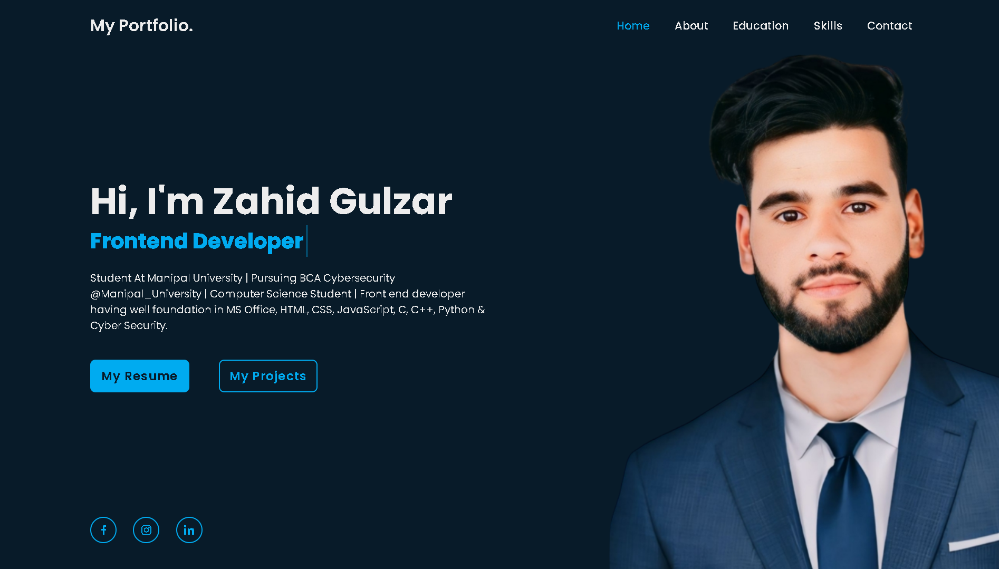

# 🌐 Personal Portfolio Website

This is my personal **portfolio website** built using **HTML, CSS, and JavaScript**.  
It showcases my projects, skills, and contact details in a clean and responsive design.

---

## ✨ Features
- Responsive design that works on all devices 📱💻  
- Sections for **About Me, Skills, Projects, and Contact**  
- Smooth navigation and simple UI/UX  
- Built with pure **HTML, CSS, and JavaScript** (no frameworks)  

---

## 🚀 Live Demo
🔗 [View Portfolio](https://zahidgulzar.netlify.app)

---

## 🛠️ Technologies Used
- **HTML5**  
- **CSS3**  
- **JavaScript (ES6)**  

---

## 📷 Preview
   

---

## 📬 Contact
If you’d like to get in touch:  
- 📧 Email: zahidgulzar1926@gmail.com  
- 💼 LinkedIn: https://linkedin.com/in/zahid-gulzar
- 🐙 GitHub: https://github.com/zahid-gulzar/  
